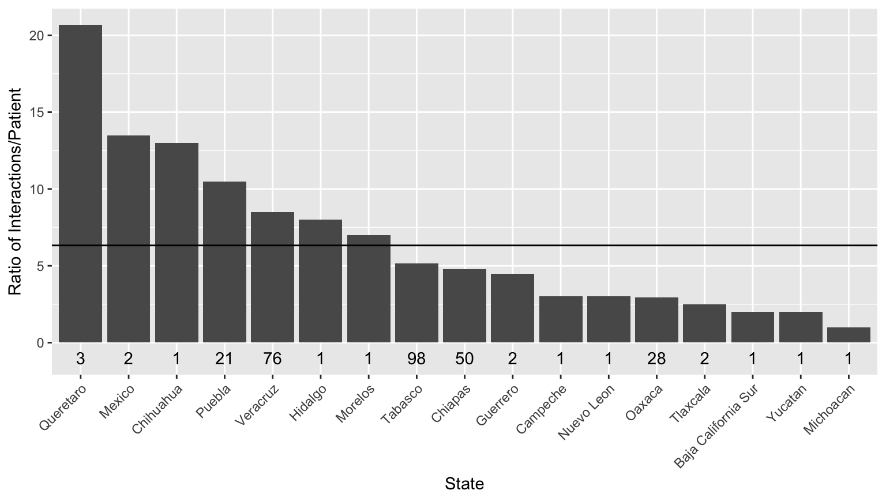

MATH 216 Data Science Final Project (Fall 2016)
================

-   Name: Emily Goins 
-   Project title: Medical Complication Trends of Undocumented Mexican Migrant Workers in Addison County, Vermont
-   Write-up on RPubs: <http://rpubs.com/egoins/FinalProject>
-   Abstract: The present analysis explores the distribution of health issues amongst undocumented Mexican immigrants in Addison County, VT. First, the study demonstrates the distribution of geographic origins of the Mexican immigrants, and how it correlates with their health conditions and medical interactions with the clinic. Next, to further investigate for differences in medical conditions and medical interactions, the analysis explores demographic data to determine qualitative correlations between these demographic factors and illness prevalance. All health and demographic data was pulled from patient charts on the website for the Vermont Coalitions of Clinics for the Uninsured. Ulimately, this investigation produces interactive graphs that can be used by the Open Door Clinic to better depict, describe, and predict their patient population.

